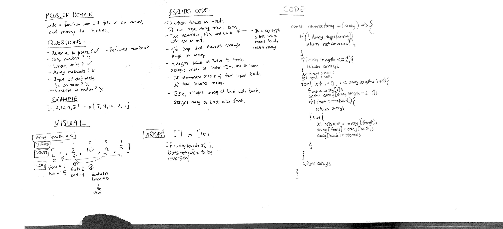

# Reverse an Array
This function will take in an input, determine whether it is an array, and if it is, it will reverse the contents of the array.

## Challenge
This function had to take into account inputs that were not arrays, inputs that were empty arrays, and arrays that were odd or even in length. This challenge was also completed without array methods.

## Approach & Efficiency
I used if statements to determine whether it was a valid array, and if it was a valid array, if it needed to be reversed. If it did, I then used a for loop to increment through the first half of the array, swapping the incremented value and its corresponding value from the other end. I ended up only incrementing through the first half of the loop because only the first half needed it, and this would take into account both odd and even array lengths.

## Solution
Note: The whiteboard image does not show my updated approach. A better approach was thought of after the whiteboard and implemented in the code, although the whiteboard image does convey a similar thought process.
