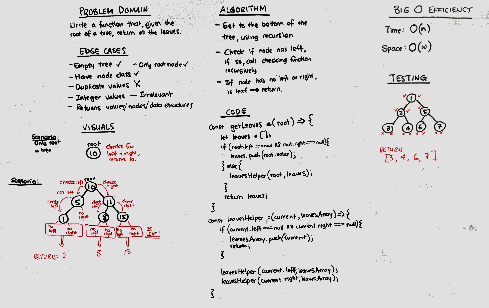

# Challenge Summary
Write a function that finds all the leaves on a binary tree.

## Challenge Description
Using recursion, perform depth-first traversal to find all leaves and add to an array.

## Approach & Efficiency
Used depth-first traversal using recursion. 
O(n) for time.
O(h) for space, using the call stack.
O(1)* for array.push()

## Solution
