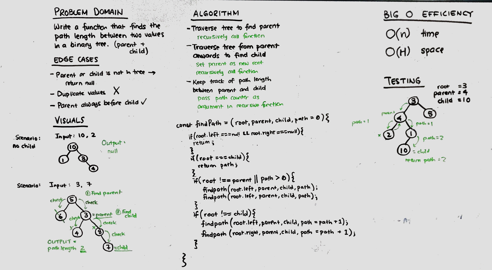

# Challenge Summary
Write a function that finds the path between two values on a binary tree.

## Challenge Description
Using recursion, perform depth-first traversal to find the parent value. If it exists, find the child value, and return the path length between the parent and child values. 

## Approach & Efficiency
Used depth-first traversal using recursion. 
Use if statements to check if the tree was empty, if it had reached the leaf of a tree without finding the child, or if the value was equal to the child value. 

O(n) for time.
O(h) for space, using the call stack.

## Solution
