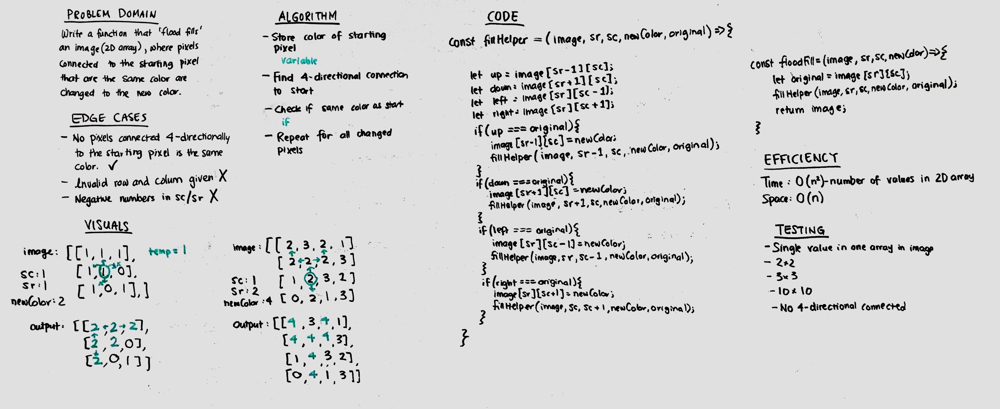

# Challenge Summary
Write a function that, given a 2D array and coordinates, "flood fills" the image with a new color.

## Challenge Description
- Given a 2D array with integers. Coordinates are also given as integers. 
- New color is also an integer. Change the 'color' at the coordinates to the new color (one integer to the new integer).
- Also change all adjacent 'pixels' next to the starting coordinate to the new color, if the adjacent pixels are of the same color as the starting integer. 
- Continue to change all adjacent pixels to the changed pixels, until all the adjacent pixels of the same color are changed.

## Approach & Efficiency
- Depth first search: O(n) time, as we may have to search every single pixel, O(n) space, as call stack may be the total number of pixels if each pixel must be changed.

## Solution
Final solution has been changed from original whiteboard solution.
