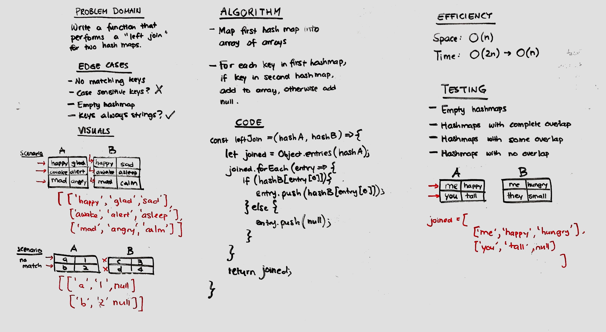

# Hashmap LEFT JOIN
Implement a left join for two hash maps.

## Challenge
Write a function that takes in two hash maps, implement a left join where the returned data structure contains the keys and values from first hash map, and either the value that matches the key from the second hash map, or null if the key does not exist in the second hash map.

## Approach & Efficiency
- Iterated through the first hash map using .forEach, and checking if the second has map has the corresponding key - O(n) time, where n is the number of keys in first hash map
- Pushed key, value, and second hash table value into an array - O(1) time
- Stored and returned values in an array of arrays - O(n) space

## Solution
Solution is not as displayed on whiteboard image. 
