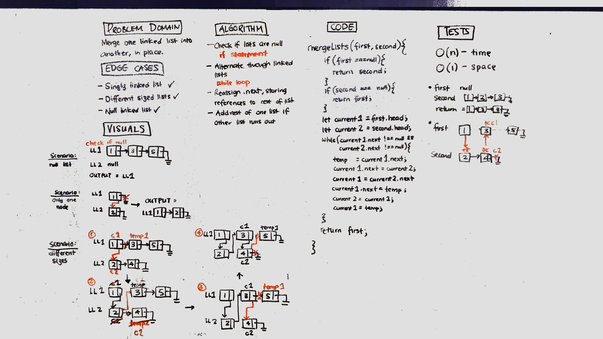

# Challenge Summary
Merging two linked lists in place, so that the values are zippered.

## Challenge Description
Write a function that, taking in two linked lists, returns the first linked list, with the values of the second linked list merged in. 

## Approach & Efficiency
* Uses if statements to check if either lists are null, or whether to append the rest of the list if one list runs out of values.
* Uses a while loop to traverse through both linked lists at the same time, redirecting the links to form a single linked list from the two. 
* O(n) time and O(1) space efficiency

## Solution
