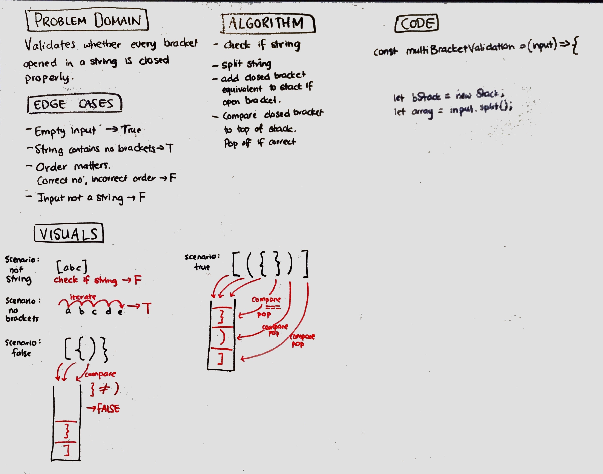

# Challenge Summary
Validating that brackets match in a string.

## Challenge Description
Return a true if all brackets are paired correctly in a string. Return false if they are incorrectly paired or there are brackets missing. Can be a mix of different types of brackets.

## Approach & Efficiency
* Used for loop to iterate through the string - O(n) time
* Used a stack to keep track of open brackets - O(n) space

## Solution

© Code Fellows 2019