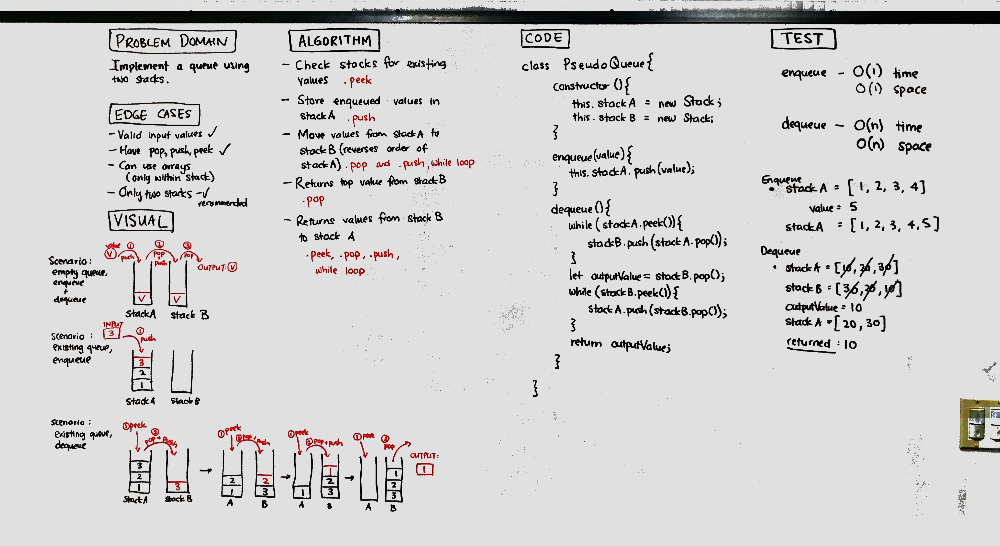

# Challenge Summary
Use two stacks (First In Last Out) to create a pseudo Queue, where the elements follow a First In First Out order. 

## Challenge Description
Not being able to use or make a queue, we only had access to a Stack's methods of pop, push, and peek.

## Approach & Efficiency
* I used stack A for the storage of the values in the pseudo Queue, using push.
   * O(1) time/space
* Stack B was used when dequeuing, with elements from stack A popped off and added to Stack B. When stack A is empty, the top element from stack B was popped and returned, thus the value was First In First Out.
   * O(n) time, O(1) space

## Solution
