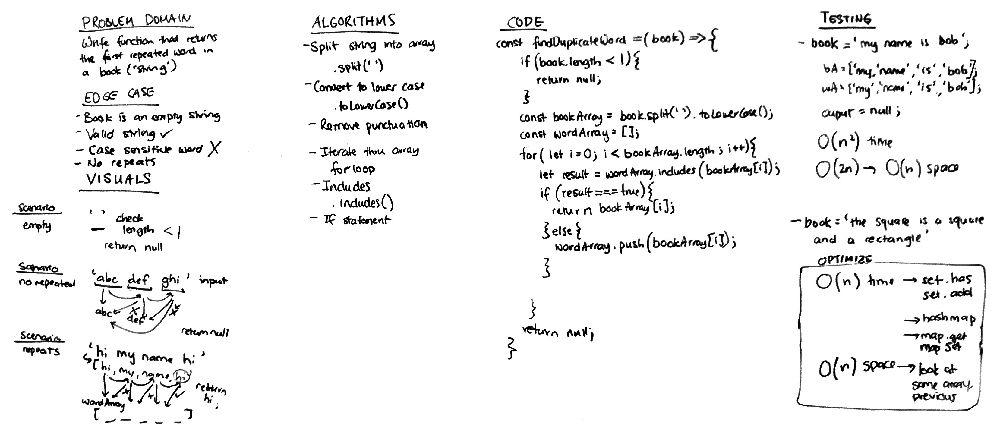

# Challenge Summary
Write a function that returns a repeated word within a string.

## Challenge Description
Given that the input is always a string, check each word in the string and return a repeated word, if there is one, in that string. 
The challenge is being able to check each word in the string, and also being able to store the words that have previously been checked in the string. 

## Approach & Efficiency
* I split the string into an array to be able to tackle each word individually - O(n) space
* Iterate through the array to check each word - O(n) time
* Checking whether the wordSet has the word currently being checked in the bookArray - O(1) time
* Adding the word to the set - O(1) time

## Solution
