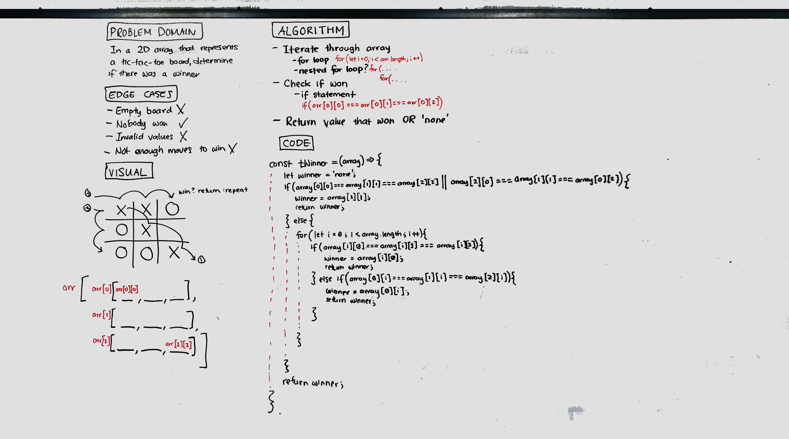

# Challenge Summary
Find the winner of a tic-tac-toe board, given that it is a 2D array.

## Challenge Description
Find whether x or o won, by searching through the 2D array to find 3 in a row either vertically, horizontally, or diagonally.

## Approach & Efficiency
Using if statements to compare the values at each point of the arrays, and using a for loop to check vertical and horizontal. O(1) efficiency because the board never gets bigger.

## Solution
