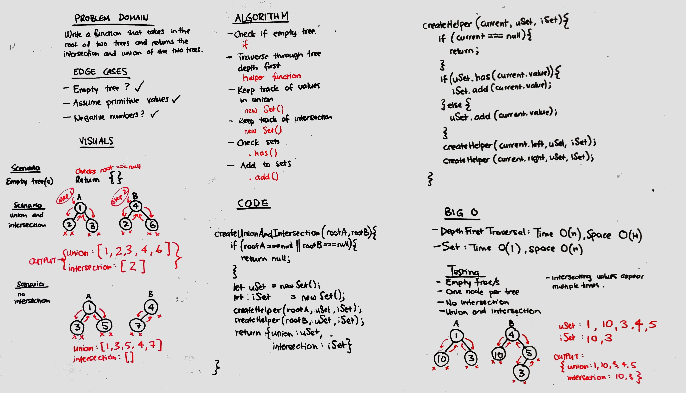

# Challenge Summary
Write a function that returns the union and intersection of two trees.

## Challenge Description
Write a function that, given two tree roots, returns an object that includes both the union and intersections of the two trees as properties. 

## Approach & Efficiency
- Depth-first traversal - O(n) time, O(H) space
- Union set - O(1) time, O(n) space
- Intersection set - O(1) time, O(n) space

## Solution
