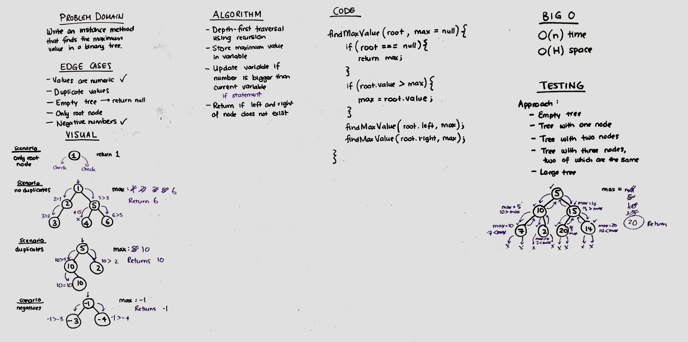

# Challenge Summary
Find the maximum value in a binary tree.

## Challenge Description
Traverse each node of a binary tree, store the largest value to a variable, update the variable if found a node with a larger value, return variable.

## Approach & Efficiency
Depth-first traversal of binary tree 
- O(n) time, because it must traverse through each node in the tree
- O(H) space, because the call stack will never exceed the height of the tree
Storage of largest value in max variable
- O(1) time and space, because only one value is being stored at a time

## Solution
