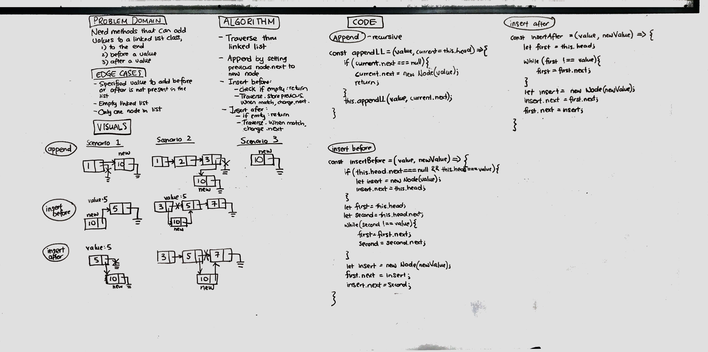

# Singly Linked List
A linked list is a linked data structure with a set of sequentially linked records, called nodes. 

## Challenge
Create a linked list class, with the following methods:
* Insert a node at the head
* Check to see if the linked list includes an inputted value
* Print all the nodes in a string
* Append a node to the tail of the list
* Insert a node before a specified value
* Insert a node after a specified value

## Approach & Efficiency
* When inserting, achieved O(n) by identifying the head and rerouting. Does not require traversal.
* When checking includes and printing to a string, traversal mean that it was O(n) value. Needed traversal to reach multiple nodes in the linked list.
* Insert nodes at the end, or before or after a value also required traversal.

## Solution
* Insert - Identified and rerouted new node and head node - O(1)
* Includes - Traversed linked list to check if current value matches input value - O(n)
* toString - Traversed linked list, adding current value to existing string - O(n)
* append - If list had only one node, added node. If list had more than one, traversed list until the final node - O(n)
* insertBefore - Traversed linked list, references to two nodes, added node if second reference was the specified value - O(n)
* insertAfter - Traversed linked list. If referenced node matched value, inserted new node after - O(n)
